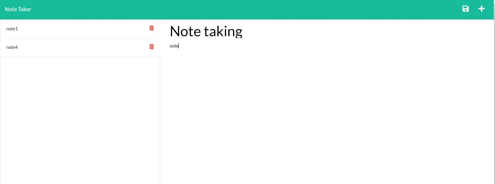

# Note Taker Starter Code

The purpose for this app is to provide a simple note taking and saving tool for everyone. It is great for orgainizing thoughts, keep track of tasks, ceate a bucket list, and many more. Since this app doesn't have reminder or time tracking feature, it makes the app looks more clean and has a bigger note taking area.

#### The app look like the following

## Deployed Application
[Link to App](https://afternoon-taiga-66988.herokuapp.com/)

## Built With
* Javascript
* HTMl
* CSS

## License
Licensed under the MIT license.

